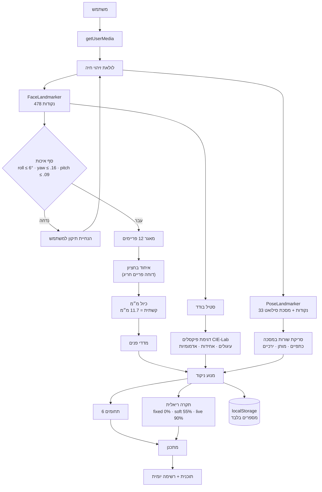
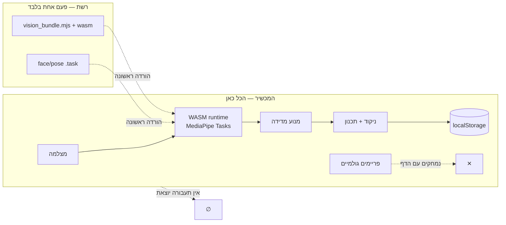
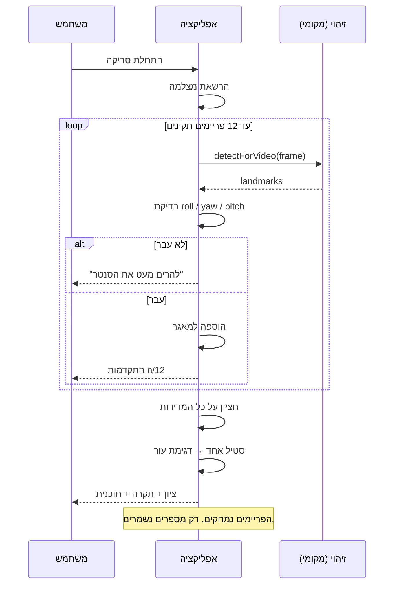

# Architecture

## Data flow



## Trust boundary

The point of the diagram below is that **there is no server**. The trust boundary
is the browser tab; nothing crosses it except a one-time model download.



## Scan sequence



## Why these choices

### Iris as the ruler
A photograph has no scale: the same face fills the frame differently at 30 cm and
60 cm, so every pixel measurement is meaningless on its own. The horizontal iris
diameter is one of the few human dimensions that barely varies — about 11.7 mm
across age, sex and ethnicity. Landmarks 468–477 give us that ring, and dividing
through by it converts the whole mesh into millimetres. It is what lets the report
say "asymmetry of 1.8 mm" instead of "asymmetry of 0.004 units".

Verified empirically in `test/pipeline.mjs`: the shipped model returns **478**
landmarks with the iris ring populated.

### Median over multiple frames, not one shot
Landmark output jitters frame to frame. Taking one frame means the user gets a
different score each time they press the button, which destroys trust faster than
any inaccuracy. The scanner keeps only frames that pass the pose gate and takes
the median of every numeric leaf — a mean would still be dragged by one bad frame.

### Segmentation mask for waist and hips
Pose landmarks give joints. A waist is not a joint. Scanning the segmentation mask
row by row and taking the widest contiguous run at each height gives the actual
silhouette width, and taking the *narrowest* row in the band between ribs and hips
finds the waist the way a tape measure would.

### The modifiability tier
Every metric is `fixed`, `soft` or `live`. This single field is what keeps the app
honest: the "potential" score sums achievable gain only, so a narrow gonial angle
contributes exactly zero to what the app promises. A test asserts this invariant
(`SKELETAL metrics never promise headroom`) so it cannot regress.

### Bars, not a radar
Radar charts equalise axes that are not comparable and make precise reading almost
impossible — the wrong tool for something claiming to be a measuring instrument.
Domain scores are horizontal bars in one sequential hue with a target tick, and
every chart ships a table view.

### Colour
One data hue (teal, H=172) carries all magnitude. Amber and red are reserved for
status and always ship with an icon and a word, never colour alone. The palette was
generated and machine-validated against the six checks (lightness band, chroma
floor, CVD separation, normal-vision floor, contrast) rather than picked by eye —
worst all-pairs CVD ΔE 10.8, normal-vision ΔE 16.4, all steps ≥ 3:1 on the surface.

Deliberately *not* used: a red-to-green gradient across the score. Painting a
person's face red is a design decision with a cost, and the status word carries
the same information without it.

## Module map

| Module | Responsibility |
|---|---|
| `analysis/geometry.js` | vectors, angles, polygon measures, band scoring, median |
| `analysis/landmarks.js` | MediaPipe index constants, mirror pairs, iris constant |
| `analysis/faceMetrics.js` | canonicalisation (roll correction), mm calibration, 20 facial measures |
| `analysis/skin.js` | sRGB→Lab, trimmed patch sampling, under-eye / evenness / redness |
| `analysis/bodyMetrics.js` | silhouette row-scanning, ratios, posture angles |
| `analysis/scoring.js` | band scores → domains → overall + honest ceiling |
| `content/metricsCatalog.js` | 24 metrics: targets, evidence grade, modifiability, Hebrew copy |
| `content/protocols.js` | 38 protocols: evidence, cost, weeks, risk, steps |
| `content/planner.js` | opportunity → protocol ranking, capped daily list, timeline |
| `scan/camera.js` | stream lifecycle, still capture, human-readable errors |
| `scan/scanner.js` | quality gate, live hints, multi-frame fusion |
| `ui/charts.js` | ring meter, domain bars, progress line, table view |
| `ui/overlay.js` | annotated face/body render |
| `lib/store.js` | localStorage, history, streak |
| `lib/mp.js` | model loading, overridable sources for self-hosting |

## Tests

| File | What it covers |
|---|---|
| `test/metrics.mjs` | 43 assertions — geometry invariants (roll-invariance of tilt, width and asymmetry), silhouette measurement, colour conversion, catalogue integrity, the no-headroom-for-skeletal-metrics invariant, planner bounds |
| `test/smoke.mjs` | boots the real page in Chromium, fails on any console error, renders every screen, asserts no horizontal overflow |
| `test/pipeline.mjs` | loads the **real** MediaPipe runtime and both models, constructs the detectors with this app's exact options, confirms 478 landmarks, runs the full measure→score chain on genuine detector output |

`test/pipeline.mjs` needs a local copy of the package:

```bash
curl -sL https://registry.npmjs.org/@mediapipe/tasks-vision/-/tasks-vision-0.10.21.tgz | tar xz
MP_DIR=$PWD/package node test/pipeline.mjs
```

## Known limits

- **Trichion is approximated.** FaceMesh has no hairline point; landmark 10 (upper
  forehead) stands in. The facial-thirds metric is flagged `approx` in the
  catalogue and labelled as an estimate in the UI.
- **Single-camera depth.** Everything is measured in the image plane. Head yaw
  beyond the gate is rejected rather than corrected, because a projective
  correction from one view would add more error than it removes.
- **Skin metrics depend on lighting.** Mixed or coloured light shifts Lab values.
  The scanner reports an exposure sanity check, but it cannot fully normalise a
  bad-light capture — consistent lighting matters for tracking over time.
- **Body ratios need a square-on shot.** The front gate checks shoulder-to-hip
  diagonal symmetry and rejects a rotated stance.
